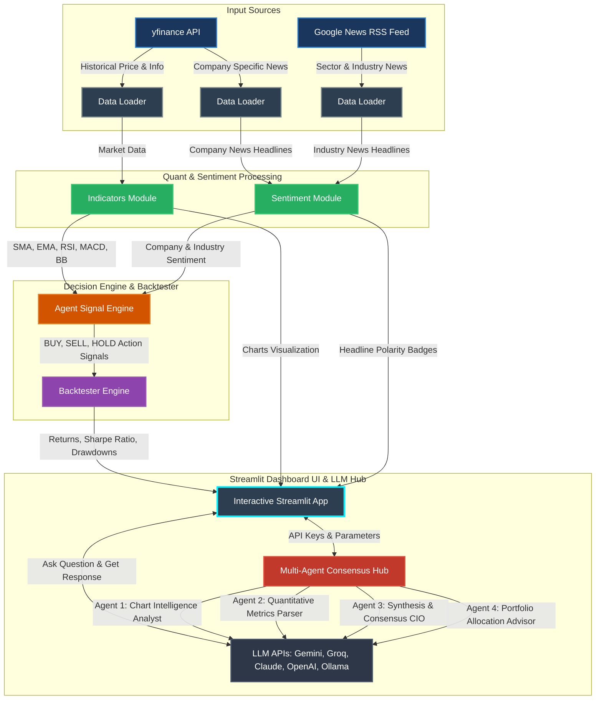

# 📈 AlphaAgent: AI-Powered Multi-Agent Stock Analysis & Backtesting Dashboard

An interactive, premium stock research platform, automated quant-trading agent, historical strategy backtester, and multi-agent consensus hub. This dashboard is powered by Streamlit, `yfinance`, NLTK VADER sentiment analysis, and a self-correcting multi-agent LLM workflow.

> [!WARNING]
> **Financial Disclaimer**: This application is for educational and informational purposes only. It does NOT claim or guarantee assured results, profits, or trading success. Do NOT rely on the quantitative signals, backtesting metrics, sentiment scores, or AI consensus suggestions generated by this app to make financial decisions. All trading and investing involve high risk. Always make your own independent investment decisions, conduct your own thorough research, and consult with a licensed financial advisor before making any financial commitments.

---

## 🏗️ System Architecture & Data Flow

Below is the diagram showing how data flows through the application—from external APIs, through quantitative indicator and sentiment analysis modules, into the decision and backtesting engines, and finally rendering on the interactive Streamlit UI.



---

## 🗺️ Codebase Directory Map

Click on any file link to inspect the implementation directly:
* 📥 [data_loader.py](file:///C:/Users/aryan/Documents/VSCODE/stock_agent/data_loader.py) — Fetches historical data, company details, and news feeds.
* 🧮 [indicators.py](file:///C:/Users/aryan/Documents/VSCODE/stock_agent/indicators.py) — Math engines calculating SMA, EMA, RSI, MACD, and Bollinger Bands.
* 🧠 [sentiment.py](file:///C:/Users/aryan/Documents/VSCODE/stock_agent/sentiment.py) — Performs lexical-based headline sentiment classification using NLTK VADER.
* 🤖 [agent.py](file:///C:/Users/aryan/Documents/VSCODE/stock_agent/agent.py) — Consolidates quant and sentiment scores into trading actions.
* 📈 [backtester.py](file:///C:/Users/aryan/Documents/VSCODE/stock_agent/backtester.py) — Simulates strategy returns, trade logs, and metrics against a Buy & Hold benchmark.
* 🎨 [app.py](file:///C:/Users/aryan/Documents/VSCODE/stock_agent/app.py) — Core Streamlit dashboard rendering live streams, charts, comparisons, and the Multi-Agent LLM Consensus Panel.

---

## 🧮 Mathematical Calculations & Metrics

The platform utilizes a comprehensive set of mathematical metrics to power its indicators, trading decisions, and performance evaluations:

### 1. Technical Analysis Indicators
* **Simple Moving Average (SMA)**:
  $$SMA_N = \frac{\sum_{i=1}^N Price_{t-i+1}}{N}$$
  Identifies price trends over a specified period (typically 20 or 50 days).
* **Exponential Moving Average (EMA)**:
  $$EMA_t = \left(Price_t \times \frac{2}{N+1}\right) + \left(EMA_{t-1} \times \left(1 - \frac{2}{N+1}\right)\right)$$
  Tracks trends with a higher weighting assigned to recent data points.
* **Relative Strength Index (RSI)**:
  $$RSI = 100 - \left(\frac{100}{1 + RS}\right)$$
  Where $RS = \frac{\text{Average Gain over } 14 \text{ periods}}{\text{Average Loss over } 14 \text{ periods}}$. Indicates overbought ($>70$) or oversold ($<30$) boundaries.
* **Moving Average Convergence Divergence (MACD)**:
  $$\text{MACD Line} = EMA_{12}(Price) - EMA_{26}(Price)$$
  $$\text{Signal Line} = EMA_9(\text{MACD Line})$$
  $$\text{Histogram} = \text{MACD Line} - \text{Signal Line}$$
  Highlights trend direction and momentum crossovers.
* **Bollinger Bands**:
  $$\text{Middle Band} = SMA_{20}$$
  $$\text{Upper Band} = SMA_{20} + \left(2 \times \sigma_{20}\right)$$
  $$\text{Lower Band} = SMA_{20} - \left(2 \times \sigma_{20}\right)$$
  Where $\sigma_{20}$ represents the standard deviation of the close price over the last 20 periods. Indicates asset volatility envelopes.

### 2. Lexical News Sentiment Scorer
* **VADER Compound Score**:
  $$Score_{normalized} = \frac{x}{\sqrt{x^2 + \alpha}}$$
  Where $x$ is the sum of valence scores of words in the text, and $\alpha = 15$. Scores are normalized to fall between $-1.0$ (highly bearish) and $+1.0$ (highly bullish).

### 3. Strategy Performance Backtesting
* **Cumulative Strategy Return**:
  $$Return_{pct} = \frac{\text{Portfolio Value}_{final} - \text{Starting Capital}}{\text{Starting Capital}} \times 100$$
* **Annualized Sharpe Ratio**:
  $$\text{Sharpe Ratio} = \sqrt{252} \times \frac{\text{Mean Daily Return} - R_f}{\sigma_{daily}}$$
  Measures risk-adjusted performance (assumes risk-free rate $R_f = 0$).
* **Maximum Drawdown (MDD)**:
  $$MDD = \max \left( \frac{\text{Peak Value} - \text{Trough Value}}{\text{Peak Value}} \right) \times 100$$
  Captures the maximum peak-to-trough decline in portfolio equity.

---

## 📚 Libraries & Dependencies Used

* **Streamlit (`streamlit`)**: Custom responsive styling, UI widgets, sidebar navigation, real-time reloading, state management.
* **Pandas (`pandas`)**: Data cleaning, indexing alignment, rolling technical window math, and time series filtering.
* **NumPy (`numpy`)**: Fast statistical operations (standard deviation computations, square roots, array math).
* **Plotly (`plotly.graph_objects`, `plotly.subplots`)**: Custom candlestick overlays, horizontal guidelines, multi-subplot layout structures (Price, RSI, MACD).
* **yfinance (`yfinance`)**: Downloads raw daily pricing data, corporate meta profiles, real-time ticker statistics, and company news headlines.
* **nltk (`nltk.sentiment.vader`)**: Performs lexicon-based valence analysis on headline strings.
* **Standard Python Utility Libraries (`urllib.request`, `json`, `re`)**: Handles clean, non-blocked HTTP payloads and parse rules for AI providers.

---

## ⚙️ Functioning of the System Components

The dashboard orchestrates several internal modules to deliver real-time metrics and advisory reports:

1. **Data Loader (`data_loader.py`)**: Fetches financial price sheets, company stats, and RSS feeds. Standardizes regional ticker codes (e.g. converting `AAPL` or appending `.NS`/`.BO` for Indian listings) and handles local caching to respect API rate limits.
2. **Indicators Calculator (`indicators.py`)**: Employs rolling statistical windows on Pandas columns to generate technical indices (SMA, EMA, RSI, MACD, Bollinger Bands) for every trading day.
3. **Sentiment Engine (`sentiment.py`)**: Tokenizes news headlines, filters out duplicate stories to prevent news coverage bias, evaluates words against the VADER dictionary, and returns an averaged compound sentiment score.
4. **Decision Agent (`agent.py`)**: Integrates indicators and news sentiment compound scores into an **Agent Score** $(-1.0 \text{ to } +1.0)$ using user-defined weights. Automatically issues BUY (score $\ge 0.25$), SELL (score $\le -0.25$), or HOLD actions.
5. **Strategy Backtester (`backtester.py`)**: Simulates the execution of those BUY/SELL actions on historical price sequences (applying an all-in strategy), logs individual transactions, and evaluates strategy returns against a Buy & Hold benchmark.
6. **Multi-Agent Hub (`app.py`)**: Coordinates four distinct quantitative agent personas (Chart Analyst, Quant Metrics Parser, Synthesis CIO, Portfolio Advisor) in a concurrent LLM consensus workflow to generate structural advice.
7. **Direct Q&A Response (`app.py`)**: Fetches detailed, full-length answers directly from the selected LLM provider using a generous token limit (up to 4000 tokens) to ensure complete explanation without truncations or cutoff checking overhead.

---

## 🚀 Quick Start Guide

### Prerequisites
Make sure you have **Python 3.9+** installed on your system.

### 1. Install Project Dependencies
Run the following command to install the required libraries:
```bash
pip install -r requirements.txt
```

### 2. Configure Environment API Keys (Optional)
To enable the LLM functions in the Multi-Agent Hub and AI Assistant Chat, export your API key (the application automatically detects the provider):
```powershell
# In PowerShell (Windows)
$env:GEMINI_API_KEY="your_api_key_here"
# Or
$env:OPENAI_API_KEY="your_api_key_here"
```

### 3. Start the Web Server
Launch the Streamlit web dashboard locally:
```bash
python -m streamlit run app.py
```
This automatically starts a local server and opens your browser at `http://localhost:8501`.
