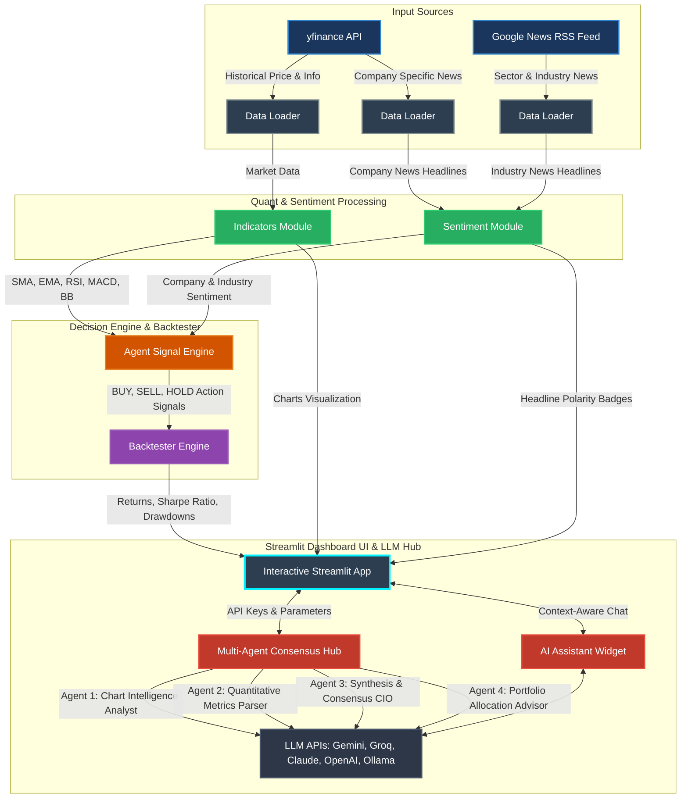

# 📈 AlphaAgent: AI-Powered Multi-Agent Stock Analysis & Backtesting Dashboard

An interactive, premium stock research platform, automated quant-trading agent, and historical strategy backtester. This dashboard is powered by Streamlit, `yfinance`, NLTK VADER sentiment analysis, and multi-agent LLM consensus.

---

## 🏗️ System Architecture & Data Flow

Below is the diagram showing how data flows through the application—from external APIs, through quantitative indicator and sentiment analysis modules, into the decision and backtesting engines, and finally rendering on the interactive Streamlit UI.



---

## 🗺️ Codebase Directory Map

Click on any file link to inspect the implementation directly:
* 📥 [data_loader.py](file:///C:/Users/aryan/Documents/VSCODE/stock_agent/data_loader.py) — Fetches historical data, company details, and news feeds.
* 🧮 [indicators.py](file:///C:/Users/aryan/Documents/VSCODE/stock_agent/indicators.py) — Math engines calculating SMA, EMA, RSI, MACD, and Bollinger Bands.
* 🧠 [sentiment.py](file:///C:/Users/aryan/Documents/VSCODE/stock_agent/sentiment.py) — Performs lexical-based headline sentiment classification using NLTK VADER.
* 🤖 [agent.py](file:///C:/Users/aryan/Documents/VSCODE/stock_agent/agent.py) — Consolidates quant and sentiment scores into trading actions.
* 📈 [backtester.py](file:///C:/Users/aryan/Documents/VSCODE/stock_agent/backtester.py) — Simulates strategy returns, trade logs, and metrics against a Buy & Hold benchmark.
* 🎨 [app.py](file:///C:/Users/aryan/Documents/VSCODE/stock_agent/app.py) — Core Streamlit dashboard rendering live streams, charts, comparisons, and the Multi-Agent LLM Consensus Panel.

---

## 🛠️ Step-by-Step Evolution: From Basic to Advanced

This project was built incrementally, transitioning from low-level API interactions to advanced multi-agent LLM consensus workflows.

### 🔹 Phase 1: Basic Foundation & Data Fetching (Basic)
The foundation layer is built inside [data_loader.py](file:///C:/Users/aryan/Documents/VSCODE/stock_agent/data_loader.py), managing interactions with online data providers:
* **Historical Prices**: Fetches market open, high, low, close, and volume details using the `yfinance` package.
* **RSS Feeds Parsing**: Standardizes XML parser connections to Google News RSS feeds to capture macroeconomic sector developments.
* **Smart Redirects & Fallbacks**: 
  * Automatically appends `.NS` or `.BO` suffixes if a user searches for an Indian stock (e.g. `TCS` -> `TCS.NS`).
  * Replaces dots with hyphens for stock share class structures (e.g. `BRK.A` -> `BRK-A` for Berkshire Hathaway).

### 🔸 Phase 2: Math & Sentiment Processing (Lower Intermediate)
Once the raw datasets are collected, processing modules convert them into usable technical and sentiment features:
* **Technical Calculations ([indicators.py](file:///C:/Users/aryan/Documents/VSCODE/stock_agent/indicators.py))**:
  * **SMA & EMA**: Generates simple and exponential moving averages to identify baseline trends.
  * **Relative Strength Index (RSI)**: Measures momentum to determine if the stock is overbought ($&gt;70$) or oversold ($&lt;30$).
  * **MACD**: Computes fast EMA, slow EMA, MACD line, signal line, and crossover histogram.
  * **Bollinger Bands**: Determines volatility thresholds using standard deviations above and below the moving average.
* **VADER Sentiment Analysis ([sentiment.py](file:///C:/Users/aryan/Documents/VSCODE/stock_agent/sentiment.py))**:
  * Employs the **NLTK VADER** Lexicon to analyze news titles.
  * Measures negative, neutral, and positive word ratios to generate a composite compound score between $-1.0$ (highly bearish) and $+1.0$ (highly bullish).

### 🔹 Phase 3: Trade Decision Systems & Backtesting (Intermediate)
This layer contains the strategy execution algorithms that calculate actions and evaluate historical performance:
* **AlphaAgent Engine ([agent.py](file:///C:/Users/aryan/Documents/VSCODE/stock_agent/agent.py))**:
  * Combines indicators by applying user-adjustable weights: Technical Indicators (Quant), Company News Sentiment, and Industry News Sentiment.
  * Compiles an **Agent Score** from $-1.0$ to $+1.0$.
  * Maps scores to final actions: **Score $\ge$ +0.25 $\rightarrow$ BUY**, **Score $\le$ -0.25 $\rightarrow$ SELL**, else **HOLD**.
* **Quant Backtester Module ([backtester.py](file:///C:/Users/aryan/Documents/VSCODE/stock_agent/backtester.py))**:
  * Simulates trades through historical windows. When a BUY action is issued, the portfolio goes "All-In" (converting cash to shares). On a SELL action, the system liquidates shares back into cash.
  * Computes standard performance metrics:
    * **Strategy Return (%)** vs. **Buy & Hold Benchmark Return (%)**
    * **Annualized Sharpe Ratio** (Mean excess return over standard deviation annualized via $252$ trading days)
    * **Max Drawdown (%)** tracking the worst peak-to-trough decline.
    * **Executed Transaction Log** listing each trade, execution date, price, and portfolio value.

### 🔸 Phase 4: Advanced Features & Dashboard Orchestration (Advanced)
The top layer ([app.py](file:///C:/Users/aryan/Documents/VSCODE/stock_agent/app.py)) merges these modules into an interactive application:
* **Premium Theme & Styling**: Styled using the Outfit font, translucent backgrounds, custom linear gradients, and a pulsing live badge.
* **Real-Time Data Streaming**: Simulates live markets by updating the current day's price dynamically using yfinance `fast_info` properties.
* **Corporate Share Class Classifier**: Decodes corporate stock structures (e.g., voting rights differences between Alphabet Class A (`GOOGL`) and Class C (`GOOG`) shares).
* **Multi-Agent Consensus Analysis Hub**:
  Orchestrates four distinct agent personas to produce a detailed investment consensus:
  1. 📊 **Agent 1: Chart Intelligence Analyst** — Inspects RSI, MACD, SMA trends, and Bollinger Band breakouts.
  2. 🧮 **Agent 2: Quantitative Metrics Parser** — Examines backtest returns, Sharpe ratios, drawdowns, and VADER sentiments.
  3. 🧠 **Agent 3: Synthesis & Consensus CIO** — Resolves conflicts between technical indicators and sentiment scores, assigning a final rating (e.g. *Strong Buy, Hold, Sell*).
  4. 💼 **Agent 4: Portfolio Allocation Advisor** — Compares performance against industry peers and suggests optimal entry prices and allocation weights.
* **AI Chat Assistant Widget**:
  * Embedded sidebar chatbot allowing users to ask questions about the stock, chart, and backtesting metrics.
  * **Key Auto-Detection**: Supports OpenAI, Gemini, Groq, Claude, and Ollama.
  * **Local Fallback Mode**: If no API key is provided, a rule-based expert parser resolves technical details locally.
* **Global Ticker Search**: Search utility scanning global exchanges to find the exact suffix requirements for any stock.
* **Stock Analysis Academy**: Educational dashboard displaying visual charts, indicator descriptions, and mathematical equations.

---

## 🚀 Quick Start Guide

### Prerequisites
Make sure you have **Python 3.9+** installed on your system.

### 1. Install Project Dependencies
Run the following command to install the required libraries:
```bash
pip install -r requirements.txt
```

### 2. Configure Environment API Keys (Optional)
To enable the LLM functions in the Multi-Agent Hub and AI Assistant Chat, export your API key (the application automatically detects the provider):
```powershell
# In PowerShell (Windows)
$env:GEMINI_API_KEY="your_api_key_here"
# Or
$env:OPENAI_API_KEY="your_api_key_here"
```

### 3. Start the Web Server
Launch the Streamlit web dashboard locally:
```bash
python -m streamlit run app.py
```
This automatically starts a local server and opens your browser at `http://localhost:8501`.

---

## 🌐 Public Sharing Options

If you want to share this dashboard with collaborators or clients:

* **Local Network Sharing (Wi-Fi)**: Ensure your dashboard server is running, and send your local IP address URL displayed in the terminal (e.g., `http://192.168.x.x:8501`) to users on your Wi-Fi network.
* **Global Ngrok Tunneling**: Expose your local port to the web:
  ```bash
  ngrok http 8501
  ```
  Copy the generated `https://xxxx.ngrok-free.app` URL and share it globally.
